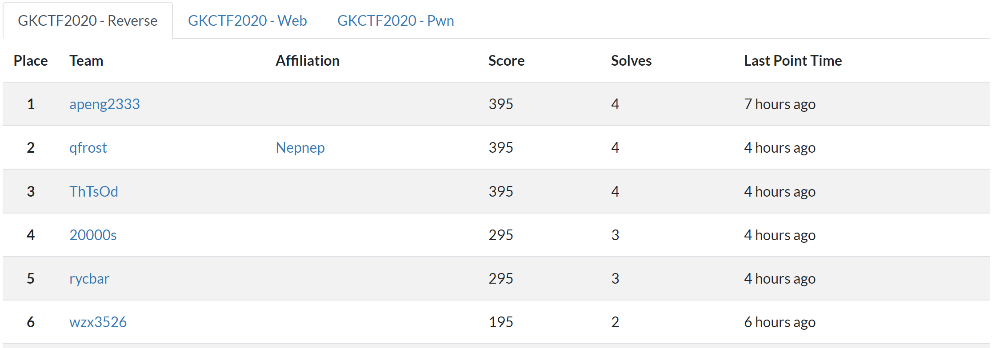
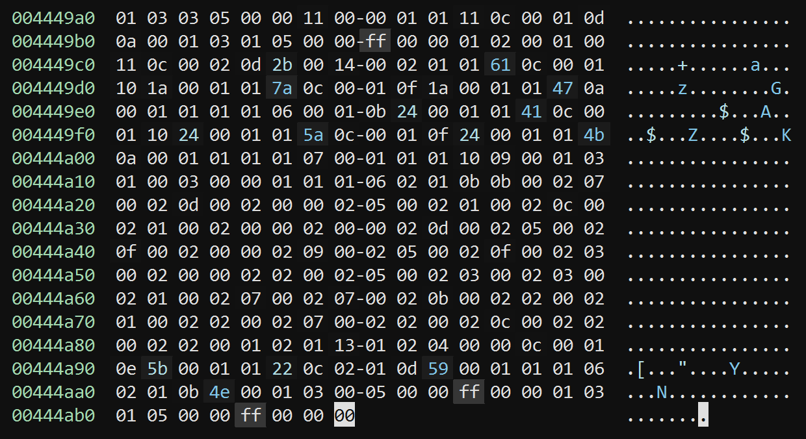
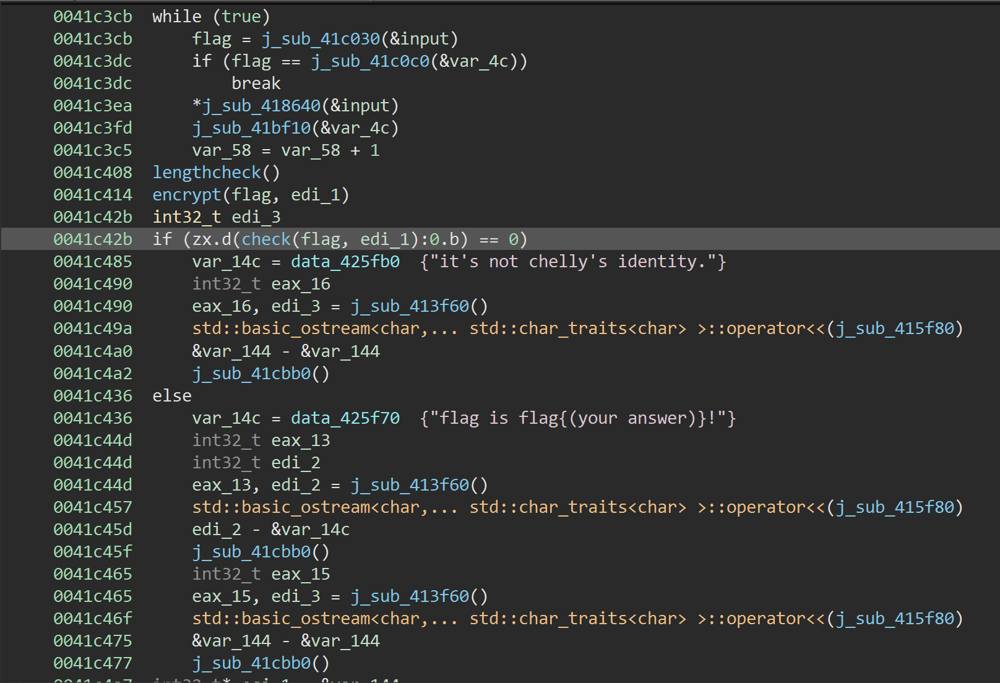
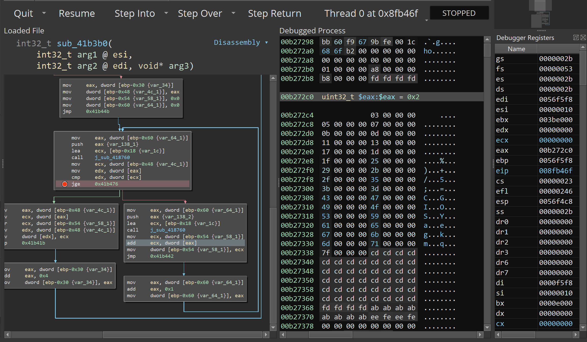
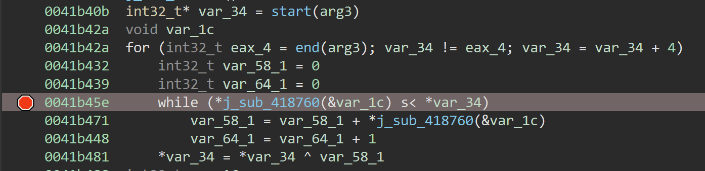
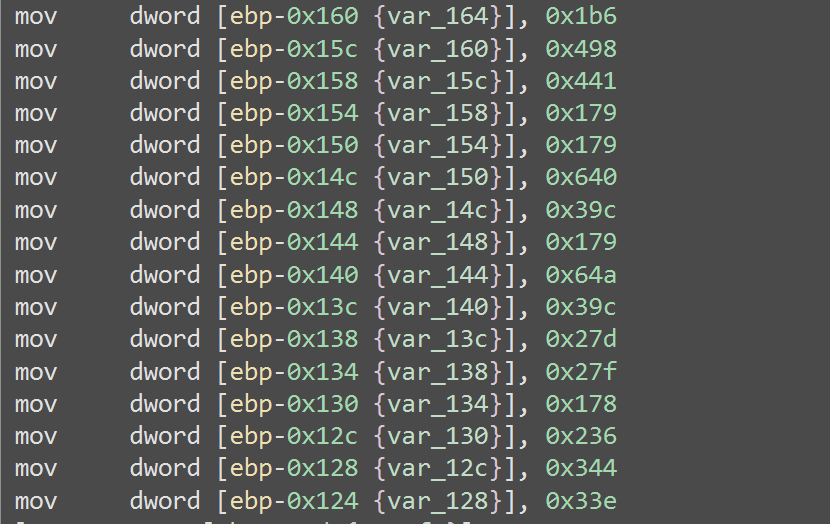
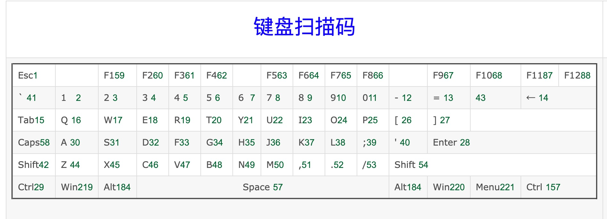

师傅们太强了，花了一天时间只拿了个单榜第5



#### checkin

打开所谓的`flag.txt`给了一串编码，`base64`解出来说要去玩弹球，输掉之后就出现了`flag`（貌似focus不在窗体上就不会一闪而过……）

flag{f5dfd0f5-0343-4642-8f28-9adbb74c4ede}

#### EzMachine

打开发现是个虚拟机，找到每个`opcode`对应的指令，大概的意思如下，不是特别精确

```python
op=0: 
index++

op=1 a,b: 
index+=3
regs[a]=b

op=2 a:
index+=3
push a


op=3 a:
index+=3
push reg[a]

op=4 a:
index+=3
pop reg[a]

op=5:
index+=3
check:
reg[3]=0:
    right
    7c00(445ba8)
reg[3]=1:
    wrong
    7c00(445ba8)
reg[3]=3:
    input
    7c00(445ba8)
reg[3]=4:
    hacker

op=6 a,b:
index+=3
add reg[a],reg[b]

op=7 a,b:
index+=3
sub reg[a],reg[b]

op=8 a,b:
index+=3
imul reg[a],reg[b]


op=9 a,b:
index+=3
idiv reg[a],reg[b]
eax=>reg[0]
edx=>reg[1]

op=0xa a,b:
index+=3
xor reg[a],reg[b]

op=0xb a:
index=3*a-3

op=0xc a,b:
index+=3
reg[3]=reg[a]-reg[b]

op=0xd a:
if reg[3]!=0:
    index+=3
else:
    index=3*a-3

op=0xe a:
if reg[3]==0:
    index+=3
else:
    index=3*a-3

op=0xf a:
if reg[3]<=0:
    index+=3
else:
    index=3*a-3

op=0x10 a:
if reg[3]>=0:
    index+=3
else:
    index=3*a-3

op=0x11 :
index+=3
input flag
flag in *445ba8
length in reg[0]

op=0x12 a,b:
index+=3
2d90(*445ba8+a,0,b)

op=0x13 a,b:
index+=3
reg[a]=*(reg[b]+*445bd0+*ebp)

op=0x14 a,b:
index+=3
reg[a]=*(reg[b]+*445ba8)
# get char from input flag 

op=0xff:
end
```

所有的`opcode`如下图



不算很多，感觉直接看可能比写`decompiler`还要快，干脆粗略浏览一下，开始进行输入然后判断长度是0x11，看到右面的`a,z,A,Z`可以想到区分大小写进行处理，在其中找到`06`发现分别使用不同的值进行异或，然后分别自增和自减，然后除0x10，余数和得到的结果分别进“栈”，下面一长串`02`压进"栈"很多数据，刚好是0x22个，很容易想到和之前计算的结果是一一对应的关系，可以直接算出`flag`

写`solution`的时候发现这两个用来异或的值恰到好处，把所有的情况刚好分开，可以直接根据算出来的值分类

```python
target = b"\x02\x07\x00\x02\r\x00\x02\x00\x00\x02\x05\x00\x02\x01\x00\x02\x0c\x00\x02\x01\x00\x02\x00\x00\x02\x00\x00\x02\r\x00\x02\x05\x00\x02\x0f\x00\x02\x00\x00\x02\t\x00\x02\x05\x00\x02\x0f\x00\x02\x03\x00\x02\x00\x00\x02\x02\x00\x02\x05\x00\x02\x03\x00\x02\x03\x00\x02\x01\x00\x02\x07\x00\x02\x07\x00\x02\x0b\x00\x02\x02\x00\x02\x01\x00\x02\x02\x00\x02\x07\x00\x02\x02\x00\x02\x0c\x00\x02\x02\x00\x02\x02\x00"

# print(len(target))
tmp = []
for i in range(0, 0x22, 2):
    tmp.append(target[3 * i + 1] * 0x10 + target[3 * (i + 1) + 1])
flag = ""
# print(tmp)
tmp.reverse()
for i in tmp:
    if i <= 31:
        flag += chr((i + 1) ^ 0x4B)
    elif i <= 63:
        flag += chr((i - 1) ^ 0x47)
    else:
        flag += chr(i)
print(flag)
# flag{Such_A_EZVM}
```

#### Chellys_identity

几乎压哨交了上去，在驱动题哪里浪费了太多时间，比赛结束了才知道有键盘扫描码这种东西……



程序的主要处理就集中在这里，输入之后检查一下长度应该是16位，否则输出`bad long!`（奇怪的英语增加了），然后对输入进行一些变换，最后对比已有的数据

在处理flag的时候先生成了一组新的数据，通过调试发现是素数集



具体的算法就是异或，不过异或的值是小于原数的所有素数的和



最后对比的时候对比这些数据



直接逆不太好逆，干脆直接遍历

```python
def Num(num):
    value = 0
    for i in range(2, num):
        for j in range(2, i):
            if i % j == 0:
                break
        else:
            value += i
    return value


v = [438, 1176, 1089, 377, 377, 1600, 924, 377, 1610, 924, 637, 639, 376, 566, 836, 830]
for j in range(16):
    for i in range(255):
        if i ^ Num(i) == v[j]:
            print(chr(i), end='')
# Che11y_1s_EG0IST
```

---

#### babydriver

这题比赛的时候没做出来，驱动才刚开始学，完全不知道有键盘扫描码这种东西，卡死在最后一步了……

附上忘了哪位师傅在群里发的图



其实就是个简单的迷宫题