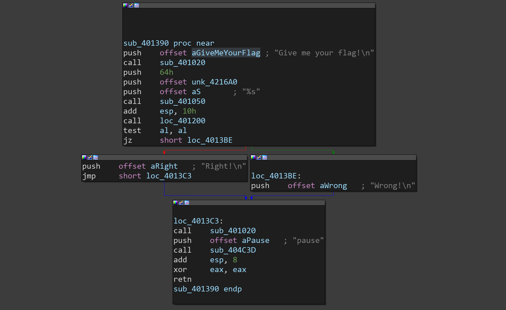

最近招新事情实在是有点多，这比赛只打了半天，做了几道re和简单的pwn，随便写一下

### re

#### transform

太简单了没什么好说的，直接上代码

```c++
#include<iostream>
#include "ida.h"
using namespace std;

int main()
{
    signed int dword_40F040[33] =
            {
                    9,
                    10,
                    15,
                    23,
                    7,
                    24,
                    12,
                    6,
                    1,
                    16,
                    3,
                    17,
                    32,
                    29,
                    11,
                    30,
                    27,
                    22,
                    4,
                    13,
                    19,
                    20,
                    21,
                    2,
                    25,
                    5,
                    31,
                    8,
                    18,
                    26,
                    28,
                    14,
                    0
            };
    char target[33] =
            {
                    103,
                    121,
                    123,
                    127,
                    117,
                    43,
                    60,
                    82,
                    83,
                    121,
                    87,
                    94,
                    93,
                    66,
                    123,
                    45,
                    42,
                    102,
                    66,
                    126,
                    76,
                    87,
                    121,
                    65,
                    107,
                    126,
                    101,
                    60,
                    92,
                    69,
                    111,
                    98,
                    77
            };
    char tmp[33];
    char flag[33];
    for(int i=0;i<=32;i++)
    {
        tmp[i]=target[i]^LOBYTE(dword_40F040[i]);
        flag[dword_40F040[i]]=tmp[i];
    }
    cout<<flag<<endl;
    return 0;
}
```

#### 撸啊撸

简单的`lua`，用了`smc`，但是调试可以之间看到执行的代码，复制出来即可

```lua
cmps={{83,80,73,80,76,125,61,96,107,85,62,63,121,122,101,33,123,82,101,114,54,100,101,97,85,111,39,97}}
print(\"Give Me Your Flag LOL!:\")
flag=io.read()
if string.len(flag)~=28 then
	print(\"Wrong flag!\")
	os.exit()
end
for i=1,string.len(flag) do
	local x=string.byte(flag,i)
	if i%2==0 then
		x=x~i
	else
		x=x+6
	end
	if x~=cmps[i] then
		print(\"Wrong flag!\")
		os.exit()
	end
end
print(\"Right flag!\")
os.exit()
```

判断的逻辑也很简单，分奇偶进行不同的操作，用python跑一遍就可以出来flag

```python
cmps = [83, 80, 73, 80, 76, 125, 61, 96, 107, 85, 62, 63, 121, 122, 101, 33, 123, 82, 101, 114, 54, 100, 101, 97, 85,
        111, 39, 97]
flag=''
for i in range(28):
    x = cmps[i]
    if (i + 1) % 2 == 0:
        x ^= (i + 1)
    else:
        x -= 6
    flag+=chr(x)
print(flag)
```

#### PixelShooter

游戏我是一点都不会打，直接解包找到`dll`在字符串视图可以直接看到`flag`

#### hello_world_go

乱七八糟看了就觉得头疼的`go`

找到主函数

```c++
__int64 __fastcall main_main(__int64 a1, __int64 a2)
{
  __int64 v2; // r8
  __int64 v3; // r9
  __int64 v4; // r8
  __int64 v5; // r9
  __int64 v6; // rdx
  __int64 v7; // r8
  __int64 v8; // rcx
  __int64 v9; // rdx
  __int64 v10; // r9
  signed __int64 v11; // rax
  __int64 result; // rax
  __int64 v13; // ST58_8
  __int64 *v14; // [rsp+8h] [rbp-A8h]
  char v15; // [rsp+18h] [rbp-98h]
  __int64 *v16; // [rsp+60h] [rbp-50h]
  __int128 v17; // [rsp+68h] [rbp-48h]
  void *v18; // [rsp+78h] [rbp-38h]
  void **v19; // [rsp+80h] [rbp-30h]
  __int128 v20; // [rsp+88h] [rbp-28h]
  __int128 v21; // [rsp+98h] [rbp-18h]

  if ( (unsigned __int64)&v19 <= *(_QWORD *)(__readfsqword(0xFFFFFFF8) + 16) )
    runtime_morestack_noctxt();
  runtime_newobject(a1, a2);
  v16 = v14;
  *(_QWORD *)&v21 = &unk_4AC9C0;
  *((_QWORD *)&v21 + 1) = &off_4EA530;
  fmt_Fprint(a1, a2, (__int64)&v21, (__int64)&unk_4AC9C0, v2, v3, (__int64)&off_4EBDA0, qword_577550);
  *(_QWORD *)&v20 = &unk_4A96A0;
  *((_QWORD *)&v20 + 1) = v16;
  fmt_Fscanf(
    a1,
    a2,
    (__int64)&off_4EBD80,
    (__int64)&v20,
    v4,
    v5,
    (__int64)&off_4EBD80,
    qword_577548,
    (__int64)&unk_4D07C9,
    2LL);
  v8 = v16[1];
  if ( v8 != 24 )
    goto LABEL_3;
  v13 = *v16;
  runtime_memequal(a1, a2, v6, (unsigned __int64)&unk_4D3C58);
  if ( !v15 )
  {
    v8 = 24LL;
LABEL_3:
    runtime_cmpstring(a1, a2, (__int64)&unk_4D3C58, v8, v7);
    if ( (signed __int64)&v20 >= 0 )
      v11 = 1LL;
    else
      v11 = -1LL;
    goto LABEL_5;
  }
  v11 = 0LL;
LABEL_5:
  if ( v11 )
  {
    *(_QWORD *)&v17 = &unk_4AC9C0;
    *((_QWORD *)&v17 + 1) = &off_4EA550;
    result = fmt_Fprintln(a1, a2, v9, (__int64)&off_4EBDA0, v7, v10, (__int64)&off_4EBDA0, qword_577550);
  }
  else
  {
    v18 = &unk_4AC9C0;
    v19 = &off_4EA540;
    result = fmt_Fprintln(a1, a2, v9, (__int64)&off_4EBDA0, v7, v10, (__int64)&off_4EBDA0, qword_577550);
  }
  return result;
}
```

看到了输出提示语，然后输入，最后进行字符串比较，输出正误，没见到有什么特殊的处理，猜测直接`flag`明文比较，点进去，得到`flag`

```
flag{hello_world_gogogo}
```

#### junk

这一题还像是一道正常难度的re……



看起来很正常的流程图，但是接下来就发现`F5`大法不好使了，猜测题目`junk`的意思应该是加了混淆，所以干脆直接看汇编

题目需要输入一个字符串并存储到了`0x4216A0`的位置，在`loc_401200`内进行判断，通过`eax`来判别是否正确，直接`call`一个位置说明在这个判断函数里动了很多手脚，进去看看

~~然后发现简直乱七八糟~~

```asm
.text:00401200 loc_401200:                             ; CODE XREF: sub_401390+1E↓p
.text:00401200                 push    ebp
.text:00401201                 mov     ebp, esp
.text:00401203                 sub     esp, 3Ch
.text:00401206                 push    ebx
.text:00401207                 push    esi
.text:00401208                 push    edi
.text:00401209                 mov     eax, [ebp+4]
.text:0040120C                 sub     esp, 0E9h
.text:00401212                 push    eax
.text:00401213                 mov     dword ptr [ebp-8], offset unk_4216A0
.text:0040121A                 mov     eax, [ebp-8]
.text:0040121D                 add     eax, 1
.text:00401220                 mov     [ebp-1Ch], eax
.text:00401223
.text:00401223 loc_401223:                             ; CODE XREF: .text:00401233↓j
.text:00401223                 mov     ecx, [ebp-8]
.text:00401226                 mov     dl, [ecx]
.text:00401228                 mov     [ebp-1], dl
.text:0040122B                 add     dword ptr [ebp-8], 1
.text:0040122F                 cmp     byte ptr [ebp-1], 0
.text:00401233                 jnz     short loc_401223
.text:00401235                 mov     eax, [ebp-8]
.text:00401238                 sub     eax, [ebp-1Ch]
.text:0040123B                 mov     [ebp-20h], eax
.text:0040123E                 mov     ecx, [ebp-20h]
.text:00401241                 mov     [ebp-24h], ecx
.text:00401244                 cmp     dword ptr [ebp-24h], 2Bh
.text:00401248                 jz      short loc_401251
.text:0040124A                 xor     al, al
.text:0040124C                 jmp     loc_401387
```

这段的意思实际上就是判断了一下字符串的长度为`0x2B`，然后进行了一个跳转，如果长度不为`0x2B`，跳转到结束部分，如果是，进行下一步的处理，然后发现下一步有个花指令

```asm
loc_401251:                             ; CODE XREF: .text:00401248↑j
.text:00401251                 call    sub_401275
.text:00401256                 call    near ptr 2BFF088Eh
.text:00401256 ; ---------------------------------------------------------------------------
.text:0040125B                 db    0
.text:0040125C                 db    0
.text:0040125D                 db    0
.text:0040125E                 db 33h
.text:0040125F                 db 0C0h
.text:00401260                 db 8Ah
.text:00401261                 db  86h
.text:00401262                 db  9Fh ; OFF32 SEGDEF [_data,42169F]
.text:00401263                 db  16h
.text:00401264                 db  42h ; B
.text:00401265                 db    0
.text:00401266                 db 34h
.text:00401267                 db    3
.text:00401268                 db 88h
.text:00401269                 db  86h
.text:0040126A                 db  9Fh ; OFF32 SEGDEF [_data,42169F]
.text:0040126B                 db  16h
.text:0040126C                 db  42h ; B
.text:0040126D                 db    0
.text:0040126E                 db 4Eh
.text:0040126F                 db 85h
.text:00401270                 db 0F6h
.text:00401271                 db 75h
.text:00401272                 db 0EBh
.text:00401273                 db 0EBh
```

开始变得乱七八糟，看一下`call`的函数内容

```asm
sub_401275      proc near               ; CODE XREF: .text:loc_401251↑p
.text:00401275                 pop     eax
.text:00401276                 add     eax, 1
.text:00401279                 push    eax
.text:0040127A                 retn
.text:0040127A sub_401275      endp
```

这就是个典型的花指令，首先`call`一个函数，相当于`push eip+jmp`，这个时候栈顶是`eip`就是函数执行结束之后需要返回的地址，但是进入这个函数之后发现，这个函数的作用就是把栈顶的`old eip`弹出到`eax`，然后`+1`，再`push`到栈顶，这使得最后返回的时候跳过了`call`命令紧接着的那个字节，所以手动去一下花，真正的指令应该是

```asm
 xor     esi, esi
.text:00401259                 mov     esi, 2Bh
.text:0040125E
.text:0040125E loc_40125E:                             ; CODE XREF: .text:00401271↓j
.text:0040125E                 xor     eax, eax
.text:00401260                 mov     al, byte ptr (dword_42169C+3)[esi]
.text:00401266                 xor     al, 3
.text:00401268                 mov     byte ptr (dword_42169C+3)[esi], al
.text:0040126E                 dec     esi
.text:0040126F                 test    esi, esi
.text:00401271                 jnz     short loc_40125E
.text:00401273                 jmp     short loc_40127B
```

对于输入的字符每一个都和3异或得到了新的字符串，这里用的`al`取低八位实际上没有什么影响，因为输入的字符都在`0~255`之间，然后接下来还有一个跳转

```asm
loc_40127B:                             ; CODE XREF: .text:00401273↑j
.text:0040127B                 xor     eax, eax
.text:0040127D                 jz      short near ptr loc_40127F+1
.text:0040127F
.text:0040127F loc_40127F:                             ; CODE XREF: .text:0040127D↑j
.text:0040127F                 call    near ptr 2BFF08B7h
.text:0040127F ; ---------------------------------------------------------------------------
.text:00401284                 db    0
.text:00401285                 db    0
.text:00401286                 db    0
.text:00401287                 db  33h ; 3
.text:00401288                 db 0C0h, 8Ah, 86h
.text:0040128B                 dd offset dword_42169C+3
.text:0040128F                 db 8Bh
.text:00401290                 dd 74DB33CEh, 0E183E801h, 0F98301h, 0C8C00574h, 0C003EB04h
.text:00401290                 dd 868804C0h
.text:004012A8                 dd offset dword_42169C+3
.text:004012AC                 dd 75F6854Eh, 2BBAD6h
.text:004012B4                 db 2 dup(0), 0B9h
.text:004012B7                 dd offset unk_4216A0
```

又是一个花指令，这个就比较明显，去花

```asm
loc_401287:                             ; CODE XREF: .text:004012AF↓j
.text:00401287                 xor     eax, eax
.text:00401289                 mov     al, byte ptr (dword_42169C+3)[esi]
.text:0040128F                 mov     ecx, esi
.text:00401291                 xor     ebx, ebx
.text:00401293                 jz      short near ptr loc_401295+1
.text:00401295
.text:00401295 loc_401295:                             ; CODE XREF: .text:00401293↑j
.text:00401295                 call    near ptr 8341F41Dh
.text:0040129A                 stc
.text:0040129B                 add     [ebp+eax-40h], dh
```

又是一个明显的花指令，接着去花，之后就没什么阻碍了

```asm
loc_40127B:                             ; CODE XREF: .text:00401273↑j
.text:0040127B                 xor     eax, eax
.text:0040127D                 jz      short loc_401280
.text:0040127D ; ---------------------------------------------------------------------------
.text:0040127F                 db 0E8h
.text:00401280 ; ---------------------------------------------------------------------------
.text:00401280
.text:00401280 loc_401280:                             ; CODE XREF: .text:0040127D↑j
.text:00401280                 xor     esi, esi
.text:00401282                 mov     esi, 2Bh
.text:00401287
.text:00401287 loc_401287:                             ; CODE XREF: .text:004012AF↓j
.text:00401287                 xor     eax, eax
.text:00401289                 mov     al, byte ptr (dword_42169C+3)[esi]
.text:0040128F                 mov     ecx, esi
.text:00401291                 xor     ebx, ebx
.text:00401293                 jz      short loc_401296
.text:00401293 ; ---------------------------------------------------------------------------
.text:00401295                 db 0E8h
.text:00401296 ; ---------------------------------------------------------------------------
.text:00401296
.text:00401296 loc_401296:                             ; CODE XREF: .text:00401293↑j
.text:00401296                 and     ecx, 1
.text:00401299                 cmp     ecx, 0
.text:0040129C                 jz      short loc_4012A3
.text:0040129E                 ror     al, 4
.text:004012A1                 jmp     short loc_4012A6
.text:004012A3 ; ---------------------------------------------------------------------------
.text:004012A3
.text:004012A3 loc_4012A3:                             ; CODE XREF: .text:0040129C↑j
.text:004012A3                 rol     al, 4
.text:004012A6
.text:004012A6 loc_4012A6:                             ; CODE XREF: .text:004012A1↑j
.text:004012A6                 mov     byte ptr (dword_42169C+3)[esi], al
.text:004012AC                 dec     esi
.text:004012AD                 test    esi, esi
.text:004012AF                 jnz     short loc_401287
.text:004012B1                 mov     edx, 2Bh
.text:004012B6                 mov     ecx, offset unk_4216A0
.text:004012BB                 call    sub_401090
.text:004012C0                 mov     dword ptr [ebp-0Ch], offset byte_421708
.text:004012C7                 mov     edx, [ebp-0Ch]
.text:004012CA                 add     edx, 1
.text:004012CD                 mov     [ebp-28h], edx
.text:004012D0
.text:004012D0 loc_4012D0:                             ; CODE XREF: .text:004012E0↓j
.text:004012D0                 mov     eax, [ebp-0Ch]
.text:004012D3                 mov     cl, [eax]
.text:004012D5                 mov     [ebp-2], cl
.text:004012D8                 add     dword ptr [ebp-0Ch], 1
.text:004012DC                 cmp     byte ptr [ebp-2], 0
.text:004012E0                 jnz     short loc_4012D0
.text:004012E2                 mov     edx, [ebp-0Ch]
.text:004012E5                 sub     edx, [ebp-28h]
.text:004012E8                 mov     [ebp-30h], edx
.text:004012EB                 mov     dword ptr [ebp-10h], offset aBuedvshlmfwhpz ; "%BUEdVSHlmfWhpZn!oaWZ(aGBsZ@ZpZn!oaWZ(a"...
.text:004012F2                 mov     eax, [ebp-10h]
.text:004012F5                 add     eax, 1
.text:004012F8                 mov     [ebp-2Ch], eax
.text:004012FB
.text:004012FB loc_4012FB:                             ; CODE XREF: .text:0040130B↓j
.text:004012FB                 mov     ecx, [ebp-10h]
.text:004012FE                 mov     dl, [ecx]
.text:00401300                 mov     [ebp-3], dl
.text:00401303                 add     dword ptr [ebp-10h], 1
.text:00401307                 cmp     byte ptr [ebp-3], 0
.text:0040130B                 jnz     short loc_4012FB
.text:0040130D                 mov     eax, [ebp-10h]
.text:00401310                 sub     eax, [ebp-2Ch]
.text:00401313                 mov     [ebp-34h], eax
.text:00401316                 mov     ecx, [ebp-30h]
.text:00401319                 cmp     ecx, [ebp-34h]
.text:0040131C                 jz      short loc_401322
.text:0040131E                 xor     al, al
.text:00401320                 jmp     short loc_401387
.text:00401322 ; ---------------------------------------------------------------------------
.text:00401322
.text:00401322 loc_401322:                             ; CODE XREF: .text:0040131C↑j
.text:00401322                 mov     dword ptr [ebp-18h], 0
.text:00401329                 jmp     short loc_401334
.text:0040132B ; ---------------------------------------------------------------------------
.text:0040132B
.text:0040132B loc_40132B:                             ; CODE XREF: .text:loc_401383↓j
.text:0040132B                 mov     edx, [ebp-18h]
.text:0040132E                 add     edx, 1
.text:00401331                 mov     [ebp-18h], edx
.text:00401334
.text:00401334 loc_401334:                             ; CODE XREF: .text:00401329↑j
.text:00401334                 mov     dword ptr [ebp-14h], offset byte_421708
.text:0040133B                 mov     eax, [ebp-14h]
.text:0040133E                 add     eax, 1
.text:00401341                 mov     [ebp-38h], eax
.text:00401344
.text:00401344 loc_401344:                             ; CODE XREF: .text:00401354↓j
.text:00401344                 mov     ecx, [ebp-14h]
.text:00401347                 mov     dl, [ecx]
.text:00401349                 mov     [ebp-4], dl
.text:0040134C                 add     dword ptr [ebp-14h], 1
.text:00401350                 cmp     byte ptr [ebp-4], 0
.text:00401354                 jnz     short loc_401344
.text:00401356                 mov     eax, [ebp-14h]
.text:00401359                 sub     eax, [ebp-38h]
.text:0040135C                 mov     [ebp-3Ch], eax
.text:0040135F                 mov     ecx, [ebp-18h]
.text:00401362                 cmp     ecx, [ebp-3Ch]
.text:00401365                 jnb     short loc_401385
.text:00401367                 mov     edx, [ebp-18h]
.text:0040136A                 movsx   eax, byte_421708[edx]
.text:00401371                 mov     ecx, [ebp-18h]
.text:00401374                 movsx   edx, byte ptr aBuedvshlmfwhpz[ecx] ; "%BUEdVSHlmfWhpZn!oaWZ(aGBsZ@ZpZn!oaWZ(a"...
.text:0040137B                 cmp     eax, edx
.text:0040137D                 jz      short loc_401383
.text:0040137F                 xor     al, al
.text:00401381                 jmp     short loc_401387
.text:00401383 ; ---------------------------------------------------------------------------
.text:00401383
.text:00401383 loc_401383:                             ; CODE XREF: .text:0040137D↑j
.text:00401383                 jmp     short loc_40132B
.text:00401385 ; ---------------------------------------------------------------------------
.text:00401385
.text:00401385 loc_401385:                             ; CODE XREF: .text:00401365↑j
.text:00401385                 mov     al, 1
.text:00401387
.text:00401387 loc_401387:                             ; CODE XREF: .text:0040124C↑j
.text:00401387                                         ; .text:00401320↑j ...
.text:00401387                 pop     edi
.text:00401388                 pop     esi
.text:00401389                 pop     ebx
.text:0040138A                 mov     esp, ebp
.text:0040138C                 pop     ebp
.text:0040138D                 retn
```

这些都很容易分析，可以看到先分奇偶分别进行了左右循环移位，~~虽然我看不懂这迷惑的左右移四位是什么情况~~，实际上就是每个字符前四位和后四位交换位置

然后调用了一个函数进行了处理，处理之后和已知的字符串进行对比，相同就返回正确，逻辑很简单，用来处理的函数如下

```c++
char __fastcall sub_401090(char *a1, int a2)
{
  int v2; // eax
  signed int v3; // esi
  int v4; // edi
  char v5; // al
  unsigned __int8 v6; // ah
  unsigned __int8 v7; // dh
  unsigned __int8 v8; // bh
  unsigned __int8 v9; // dl
  signed int v10; // eax
  bool v11; // cf
  unsigned __int8 v12; // cl
  int i; // ecx
  int v15; // [esp+8h] [ebp-14h]
  char v16; // [esp+10h] [ebp-Ch]
  char v17; // [esp+11h] [ebp-Bh]
  char v18; // [esp+12h] [ebp-Ah]
  char v19; // [esp+13h] [ebp-9h]
  unsigned __int8 v20; // [esp+14h] [ebp-8h]
  unsigned __int8 v21; // [esp+15h] [ebp-7h]
  unsigned __int8 v22; // [esp+16h] [ebp-6h]
  unsigned __int8 v23; // [esp+1Bh] [ebp-1h]

  v2 = a2;
  v3 = 0;
  v4 = 0;
  if ( a2 )
  {
    do
    {
      v15 = v2 - 1;
      v5 = *a1++;
      *(&v20 + v3++) = v5;
      v6 = v22;
      v7 = v21;
      v8 = v20;
      v23 = v22;
      if ( v3 == 3 )
      {
        v9 = (v22 >> 6) + 4 * (v21 & 0xF);
        v17 = (v21 >> 4) + 16 * (v20 & 3);
        v18 = (v22 >> 6) + 4 * (v21 & 0xF);
        v19 = v22 & 0x3F;
        v16 = v20 >> 2;
        byte_421708[v4] = byte_41EA00[v20 >> 2];
        byte_421709[v4] = byte_41EA00[(unsigned __int8)((v7 >> 4) + 16 * (v8 & 3))];
        byte_42170A[v4] = byte_41EA00[v9];
        byte_42170B[v4] = byte_41EA00[v6 & 0x3F];
        v4 += 4;
        v3 = 0;
      }
      v2 = v15;
    }
    while ( v15 );
    if ( v3 )
    {
      v10 = v3;
      if ( v3 >= 3 )
      {
        v12 = v23;
      }
      else
      {
        v11 = (unsigned int)v3 < 3;
        do
        {
          if ( !v11 )
          {
            sub_40150A(a1);
            JUMPOUT(*(_DWORD *)algn_4011F3);
          }
          *(&v20 + v10++) = 0;
          v11 = (unsigned int)v10 < 3;
        }
        while ( v10 < 3 );
        v12 = v22;
        v7 = v21;
        v8 = v20;
      }
      v16 = v8 >> 2;
      v17 = (v7 >> 4) + 16 * (v8 & 3);
      LOBYTE(v2) = v12 >> 6;
      v19 = v12 & 0x3F;
      v18 = (v12 >> 6) + 4 * (v7 & 0xF);
      for ( i = 0; i < v3 + 1; ++v4 )
      {
        v2 = (unsigned __int8)*(&v16 + i++);
        LOBYTE(v2) = byte_41EA00[v2];
        byte_421708[v4] = v2;
      }
      if ( v3 < 3 )
        LOBYTE(v2) = sub_4022E0(&byte_421708[v4], 46, 3 - v3);
    }
  }
  return v2;
}
```

这是一个类似于`base64`的一个编码过程，把三个字符转换成四个字符，只不过索引的计算用了一些位运算，仔细想一下很容易还原，到这里就可以把`flag`解出来了

```python
target = '%BUEdVSHlmfWhpZn!oaWZ(aGBsZ@ZpZn!oaWZ(aGBsZ@ZpZn!oYGxnZm'#%w'
flag = ''
target1 = 'ABCDEFGHIJKLMNOPQRSTUVWXYZabcdefghijklmnopqrstuvwxyz)!@#$%^&*(+/'
i = 0
tmps = []
# print(chr(0x2e))
# print(len(target))
while i < len(target):
    index0 = target1.index(target[i])
    index1 = target1.index(target[i + 1])
    index2 = target1.index(target[i + 2])
    index3 = target1.index(target[i + 3])
    i += 4
    tmp1 = index0 * 4 + ((index1 & 0x30) >> 4)
    tmp2 = ((index1 & 0xf) << 4) + ((index2 & 0x3c) >> 2)
    tmp3 = ((index2 & 3) << 6) + index3
    tmps.append(tmp1)
    tmps.append(tmp2)
    tmps.append(tmp3)

for i in tmps:
    tmp = (((i & 0xf) << 4) & 0xff) + ((i & 0xf0) >> 4)
    flag += chr(tmp ^ 3)
print(flag+'}')
```

最后凑不齐三个字符，还有下面一套的编码方式，但我懒得看了……反正已经知道最后一个字符是`'}'`，干脆直接略过，输出`flag`

```
MRCTF{junkjunkjunkcodejunkjunkcodejunkcode}
```

### pwn

就做了两道题，第一题直接溢出，第二题`shellcode`，第三题看了是格式化字符串任意写也没什么意思，就不多写了

