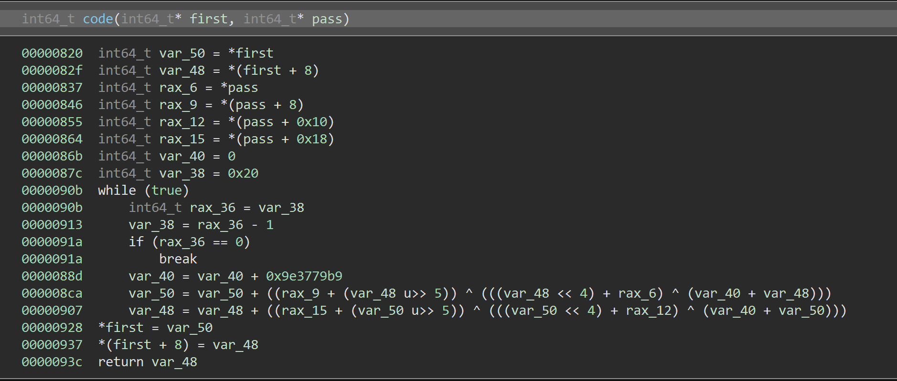

#### ViQinere

大写加密出来还是大写，小写加密出来还是小写，一些计算化简一下还是很好逆……

```python
def handle(c):
    if ord('a') <= ord(c) <= ord('z'):
        return ord(c) - ord('a')
    elif ord('A') <= ord(c) <= ord('Z'):
        return (ord(c) - ord('A')) + 128
    else:
        return c


output = "FQD{GfjuJ5UbLrWjZjpvErXkiAZzlvO0xTa!cwnLLAsy3B0iEvEy}"
flag = ""
alphabet1 = []
alphabet2 = []
box = "TaQini"
for i in range(ord('a'), ord('z') + 1):
    alphabet1.append(i)
alphabet1.reverse()
for i in range(ord('A'), ord('Z') + 1):
    alphabet2.append(i)
alphabet2.reverse()
# print(alphabet1)
v5 = 0
for i, c in enumerate(output):
    if ord('a') <= ord(c) <= ord('z'):
        index = -1
        for j in range(26):
            if alphabet1[j] == ord(c):
                index = j
                break
        tmp = handle(box[v5 & 5]) & 0x7f
        v5 += 1
        if index >= tmp:
            flag += chr(ord('a') + index - tmp)
        else:
            flag += chr(ord('a') + index - tmp + 26)

    elif ord('A') <= ord(c) <= ord('Z'):
        index = -1
        for j in range(26):
            if alphabet2[j] == ord(c):
                index = j
                break
        tmp = handle(box[v5 & 5]) & 0x7f
        v5 += 1
        if index > tmp:
            flag += chr(ord('A') + index - tmp)
        else:
            flag += chr(ord('A') + index - tmp + 26)
    else:
        flag += c

print(flag)
# BJD{ThisI5MyViQiNireCiPheRHaveY0uTr!edtOBRut3F0rCeIt}
```

#### MiscVm

很简单那的`vm`，中间有很多`opcode`一点用都没有，干脆删掉，然后把每一个操作化简并逆向处理一下，然后把之前的两次换表还原，得到`flag`

```python
opcode = [4, 1, 7, 9, 10, 9, 4, 1, 7, 9, 10, 9, 4, 1, 7, 9, 10, 9, 4, 1, 7, 9, 10, 9, 4, 1, 7, 9, 10, 9, 4,
          1, 7, 9, 10, 9, 4, 1, 7, 9, 10, 9, 4, 1, 7, 9, 10, 9]
v15 = [0x00000042, 0x0000004A, 0x00000044, 0x0000007B, 0x00000033, 0x00000370, 0x00000046, 0x000000D4, 0x0000003C,
       0x00000610, 0x0000004F, 0x000000C8, 0x0000006C, 0x00000320, 0x0000001E, 0x00000190, 0x0000006F, 0x00000630,
       0x00000046, 0x00000190, 0x0000003B, 0x00000610, 0x0000001D, 0x000000C4, 0x0000003E, 0x00000660, 0x0000004B,
       0x000000D0, 0x0000006C, 0x00000310, 0x00000046, 0x00000188, 0x00000033, 0x00000370, 0x0000004C, 0x000000CC,
       0x0000007D, 0x00000000]
v10 = 0
v9 = 4
v11 = 128
v12 = 37
v13 = 9999
while v10 < len(opcode):
    v3 = opcode[v10]
    if v3 == 1:
        v15[v9] //= 16
        v9 += 1
        v10 += 1
        continue
    if v3 == 2:
        v15[v9] -= 128
        v15[v9] //= v9
        v11 += 1
        v10 += 1
        continue
    if v3 == 3:
        v15[v9] //= 10
        v9 -= 1
        v10 += 1
        continue
    if v3 == 4:
        v15[v9] ^= 0xA
        v9 += 1
        v12 -= 1
        v10 += 1
        continue
    if v3 == 5:
        v10 += 1
        continue
    if v3 == 6:
        v9 += 1
        v15[v9] *= 10
        v10 += 1
        continue
    if v3 == 7:
        v15[v9] -= 128
        v15[v9] = ~v15[v9]
        v10 += 1
        continue
    if v3 == 8:
        v15[v9] += 1
        v15[v9] -= v13
        v9 += 1
        v10 += 1
        v13 = v13 % 1234 - 2019
        continue
    if v3 == 9:
        v9 += 1
        v10 += 1
        continue
    if v3 == 0xA:
        v10 += 1
        v15[v9] //= 4
        continue
    if v3 == 0xB:
        v10 += 1
        continue
    if v3 == 0xC:
        v9 += 1
        v10 += 1
        v15[v9] += 32
        v15[v9] ^= 0x22
    v10 += 1

# print(''.join([chr(i) for i in v15]))
indexs1 = [1, 2, 3, 4, 19, 31, 25, 14, 23, 33, 13, 9, 24, 6, 26, 34, 17, 10, 8, 29, 12, 15, 22, 11, 18, 16, 32, 28, 21,
           36, 20, 7, 5, 27, 30, 35, 37]
indexs2 = [1, 2, 3, 4, 31, 29, 7, 35, 14, 21, 9, 16, 27, 18, 25, 10, 20, 15, 17, 22, 28, 26, 36, 33, 32, 5, 8, 12, 23,
           34, 13, 30, 24, 11, 19, 6, 37]
for i in range(37):
    indexs1[i] -= 1
    indexs2[i] -= 1

tmp = [0 for i in range(37)]
flag = [0 for i in range(37)]
for i, c in enumerate(indexs2):
    tmp[c] = v15[i]
for i, c in enumerate(indexs1):
    flag[c] = tmp[i]
flag = ''.join([chr(i) for i in flag])
# print(flag)
flag = flag[:4] + flag[20:36] + flag[4:20] + flag[-1]
print(flag)
# BJD{7f099c11e53fd2bb1643429a74da9af9}

```

#### blink

打开之后直接闪瞎，看到有很多`x`，找到相应的的打印代码发现用随机数随机显示，干脆把所有的点打出来发现是个二维码，所以生成一个二维码扫一扫得到`flag`

```python
unk2004 = [0xB1, 0xB3, 0xB5, 0xB7, 0xB9, 0xBB, 0xBD, 0xA5, 0xAB, 0xAD, 0x95, 0x97, 0x99, 0x9B, 0x9D, 0x9F, 0x81, 0x00]
unk2016 = [0xB1, 0xBD, 0xA1, 0xA3, 0xA5, 0xA7, 0xAD, 0xAF, 0x95, 0x81, 0x00]
unk2021 = [0xB1, 0xB5, 0xB7, 0xB9, 0xBD, 0xA1, 0xA7, 0xAF, 0x91, 0x95, 0x99, 0x9B, 0x9D, 0x81, 0x00]
unk2030 = [0xB1, 0xB5, 0xB7, 0xB9, 0xBD, 0xA3, 0xA5, 0xA7, 0xA9, 0xAB, 0xAD, 0x95, 0x99, 0x9B, 0x9D, 0x81, 0x00]
unk2041 = [0xB1, 0xB5, 0xB7, 0xB9, 0xBD, 0xA1, 0xA5, 0xAB, 0xAD, 0x91, 0x95, 0x99, 0x9B, 0x9D, 0x81, 0x00]
unk2051 = [0xB1, 0xBD, 0xA1, 0xA9, 0xAB, 0xAF, 0x95, 0x81, 0x00]
unk205a = [0xB1, 0xB3, 0xB5, 0xB7, 0xB9, 0xBB, 0xBD, 0xA1, 0xA5, 0xA9, 0xAD, 0x91, 0x95, 0x97, 0x99, 0x9B, 0x9D, 0x9F,
           0x81, 0x00]
unk206e = [0xA1, 0xA3, 0xA5, 0xA7, 0xA9, 0xAD, 0x00]
unk2075 = [0xB1, 0xB3, 0xB7, 0xBD, 0xBF, 0xA3, 0xA7, 0xAD, 0xAF, 0x91, 0x95, 0x97, 0x99, 0x9D, 0x9F, 0x00]
unk2085 = [0xB1, 0xB7, 0xA1, 0xA5, 0xAD, 0xAF, 0x91, 0x93, 0x9F, 0x00]
unk208f = [0xB3, 0xB5, 0xBB, 0xBD, 0xBF, 0xA1, 0xA5, 0x91, 0x93, 0x9F, 0x81, 0x00]
unk209b = [0xB1, 0xB3, 0xB9, 0xBB, 0xBF, 0xA1, 0xA3, 0xA5, 0xA7, 0xA9, 0xAB, 0xAF, 0x97, 0x81, 0x00]
unk20aa = [0xB3, 0xB7, 0xB9, 0xBD, 0xA1, 0xA5, 0xA7, 0x93, 0x95, 0x99, 0x9B, 0x00]
unk20b6 = [0xBB, 0xBF, 0xA3, 0xA5, 0xA7, 0xA9, 0xAB, 0x91, 0x93, 0x97, 0x9B, 0x9F, 0x00]
unk20c3 = [0xB1, 0xB5, 0xB7, 0xBD, 0xA1, 0xA3, 0xA7, 0xAD, 0x95, 0x99, 0x9B, 0x81, 0x00]
unk20d0 = [0xB3, 0xB5, 0xB9, 0xBB, 0xBF, 0xA7, 0xA9, 0xAB, 0x91, 0x99, 0x9F, 0x81, 0x00]
unk20dd = [0xB1, 0xB3, 0xB5, 0xB7, 0xBB, 0xBD, 0xBF, 0xA1, 0xA3, 0xA9, 0xAD, 0x91, 0x93, 0x95, 0x97, 0x99, 0x9B, 0x81,
           0x00]
unk20f0 = [0xA1, 0xA5, 0xA9, 0xAB, 0x91, 0x99, 0x00]
unk20f7 = [0xB1, 0xB3, 0xB5, 0xB7, 0xB9, 0xBB, 0xBD, 0xA1, 0xA3, 0xA9, 0xAD, 0x91, 0x95, 0x99, 0x9D, 0x9F, 0x81, 0x00]
unk2109 = [0xB1, 0xBD, 0xA5, 0xA7, 0xA9, 0xAD, 0x91, 0x99, 0x9D, 0x9F, 0x00]
unk2114 = [0xB1, 0xB5, 0xB7, 0xB9, 0xBD, 0xA5, 0xA9, 0xAD, 0x91, 0x93, 0x95, 0x97, 0x99, 0x9B, 0x9D, 0x9F, 0x81, 0x00]
unk2126 = [0xB1, 0xB5, 0xB7, 0xB9, 0xBD, 0xA1, 0xA3, 0xA7, 0xA9, 0xAB, 0xAD, 0xAF, 0x97, 0x9F, 0x81, 0x00]
unk2136 = [0xB1, 0xB5, 0xB7, 0xB9, 0xBD, 0xA3, 0xA5, 0xA9, 0xAB, 0xAF, 0x93, 0x95, 0x99, 0x9B, 0x9D, 0x81, 0x00]
unk2147 = [0xB1, 0xBD, 0xA1, 0xA3, 0xA9, 0xAB, 0xAD, 0x93, 0x95, 0x99, 0x9B, 0x00]
unk2153 = [0xB1, 0xB3, 0xB5, 0xB7, 0xB9, 0xBB, 0xBD, 0xA1, 0xA3, 0xA5, 0xAF, 0x91, 0x93, 0x99, 0x9B, 0x9F, 0x81, 0x00]

off_4060 = [unk2004, unk2016, unk2021, unk2030, unk2041, unk2051, unk205a, unk206e, unk2075, unk2085, unk208f, unk209b,
            unk20aa, unk20b6, unk20c3, unk20d0, unk20dd, unk20f0, unk20f7, unk2109, unk2114, unk2126, unk2136, unk2147,
            unk2153]


def sa(i, j):
    for index in range(len(off_4060[i]) - 1):
        if j == off_4060[i][index] ^ 0xB1:
            return True

    return False


from PIL import Image

x = 25
y = 25

im = Image.new("RGB", (x, y))
for i in range(25):
    for j in range(0, 50, 2):
        if sa(i, j):
            im.putpixel((i, j // 2), (0, 0, 0))
        else:
            im.putpixel((i, j // 2), (255, 255, 255))

im.save('flag.png')
```

#### BScript

题目很诡异，明明给了一堆程序却说是一个，打开`0.exe`和`1.exe`看了看，发现需要输入和已有的数据进行对比，查看一下数据，发现了熟悉的`MZ`和`This Proagram......`，可以想到把这803个程序中的数据从拼接起来就是一个完整的可执行程序。

观察程序的大小可以发现，这里面一共有两种，一种是读取0x40个字节，按照倒序进行对比，另一种是读取0x20个字节，按照正序对比，所以写个脚本把这个隐藏的程序提取出来

- Script.py

```python
import os


def get_FileSize(filePath):
    fsize = os.path.getsize(filePath)
    return fsize

program = b""
script=b""
for i in range(804):
    if get_FileSize('%d.exe' % i) == 48643:
        with open('%d.exe'%i, 'rb') as f:
            f.read(0x1c40)
            ff = list(f.read(0x40))
            ff.reverse()
            program += bytes(ff)
    elif get_FileSize('%d.exe' % i) == 48625:
        with open('%d.exe'%i, 'rb') as f:
            f.read(0x1c20)
            ff = list(f.read(0x20))
            program += bytes(ff)
    else:
        print(get_FileSize('%d.exe' % i))
with open('easy.exe','wb+') as f:
    f.write(program)
```

然而我一运行就报错，大概是那里没弄好，也不重要，直接看算法发现是`base64`，所有的数据在程序运行过程中赋值，连字母表都没换，找到以后解一下`base64`算一下`md5`

- solution.py

```python
import base64
from hashlib import md5
target=b'QkpEe1doT3RfNF9iYWV1dDFmdTFfc2NybHB0fQAA'
flag=base64.b64decode(target)
# print(flag)
# BJD{WhOt_4_baeut1fu1_scrlpt}
m = md5()
m.update(flag[:-2])
print(m.hexdigest())
# e801bcbcc42d3120d910ccc46ae640dd
```


#### Py2

`pyo`文件没有做任何的修改，`uncompyle6`可以直接反编译

```python
import ctypes
from base64 import b64encode, b64decode

def decode():
    fd = open('./libc.so', 'rb')
    data = fd.read()
    fd.close()
    fd = open('./libc.so', 'wb')
    fd.write(b64decode(data))
    fd.close()


def check():
    if b64encode(pwd) == 'YmpkMw==':
        decode()
        dl = ctypes.cdll.LoadLibrary
        lib = dl('./libc.so')
        reply = lib.check
        reply(int(flag[:length // 2], 16), int(flag[length // 2:], 16), int(pwd.encode('hex'), 16))
        print 'your input is BJD{%s}' % flag.decode('hex')
    else:
        print 'your password is wrong!'


if __name__ == '__main__':
    print 'Please input your flag:'
    flag = raw_input()
    flag = flag.encode('hex')
    length = len(flag)
    print 'Please input your password:'
    pwd = raw_input()
    check()
```

`pwd`解一下`base64`发现是`'bjd3'`，`password`正确之后解码`so`库，调用里面的check，把flag分成前后两个部分和`pwd`一起传进去，在`code`里进行处理



很明显的`tea`算法，两组密文在`check`函数里可以找到，但是`key`并没有这么多，`decompiler`并没有表现出`key`的赋值过程，还是需要看汇编，在`check`函数最开始的时候发现了一段匪夷所思的操作


传进去的key的地址是`[rbp-0x30]`，所以四个`key`的地址应该是`0x30`,`0x28`,`0x20`,`0x18`，这几个地址的值根据上面的汇编来看都被赋成了`0x626a6433`也就是`'bjd3'`，`tea`解密很好写，如下

```cpp
#include "ida.h"
#include <iostream>

using namespace std;

int main() {
    unsigned long long v4; // [rsp+18h] [rbp-48h]
    unsigned long long v5; // [rsp+20h] [rbp-40h]
    unsigned long a2[4] = {0x626a6433,0x626a6433,0x626a6433,0x626a6433};
    v5 = 0xD760262509C2F6D0;
    v4 = 0xAF9D869B6947017D;

    unsigned long long delta = 0x9E3779B9;
    unsigned long long sum = 0;
    for (int i = 0; i < 32; i++) {
        sum += delta;
    }
    for (int i = 0; i < 32; i++) {
        v5 -= (v4 + sum) ^ ((v4 * 16) + a2[2]) ^ ((v4 >> 5) + a2[3]);
        v4 -= (v5 + sum) ^ ((v5 * 16) + a2[0]) ^ ((v5 >> 5) + a2[1]);
        sum -= delta;
        sum&=0xffffffffffffffff;
    }
    cout << hex << v4 << endl;
    cout << hex << v5 << endl;
    return 0;
}
```

输出了两部分，转成字符串连接起来

```cpp
got_tea!
```

#### log1cal

这道题目的大体流程很清楚，输入格式为`BJD{}`的`flag`，中间部分共64位，分为8个`QWORD`进行诡异的逻辑运算

```cpp
for ( i = 0; i <= 63; ++i )
  {
    *a4 = a4[1] & ~(((*a4 << 28) & ~((*a4 >> 36) & (*a4 << 28)) | ~((*a4 >> 36) & (*a4 << 28)) & (*a4 >> 36)) & a4[1]) | ~(((*a4 << 28) & ~((*a4 >> 36) & (*a4 << 28)) | ~((*a4 >> 36) & (*a4 << 28)) & (*a4 >> 36)) & a4[1]) & ((*a4 << 28) & ~((*a4 >> 36) & (*a4 << 28)) | ~((*a4 >> 36) & (*a4 << 28)) & (*a4 >> 36));
    a4[1] = a4[2] & ~(((a4[1] << 22) & ~((a4[1] >> 42) & (a4[1] << 22)) | ~((a4[1] >> 42) & (a4[1] << 22)) & (a4[1] >> 42)) & a4[2]) | ~(((a4[1] << 22) & ~((a4[1] >> 42) & (a4[1] << 22)) | ~((a4[1] >> 42) & (a4[1] << 22)) & (a4[1] >> 42)) & a4[2]) & ((a4[1] << 22) & ~((a4[1] >> 42) & (a4[1] << 22)) | ~((a4[1] >> 42) & (a4[1] << 22)) & (a4[1] >> 42));
    a4[2] = a4[3] & ~(((a4[2] << 16) & ~((a4[2] >> 48) & (a4[2] << 16)) | ~((a4[2] >> 48) & (a4[2] << 16)) & (a4[2] >> 48)) & a4[3]) | ~(((a4[2] << 16) & ~((a4[2] >> 48) & (a4[2] << 16)) | ~((a4[2] >> 48) & (a4[2] << 16)) & (a4[2] >> 48)) & a4[3]) & ((a4[2] << 16) & ~((a4[2] >> 48) & (a4[2] << 16)) | ~((a4[2] >> 48) & (a4[2] << 16)) & (a4[2] >> 48));
    a4[3] = a4[4] & ~(((a4[3] << 58) & ~((a4[3] >> 6) & (a4[3] << 58)) | ~((a4[3] >> 6) & (a4[3] << 58)) & (a4[3] >> 6)) & a4[4]) | ~(((a4[3] << 58) & ~((a4[3] >> 6) & (a4[3] << 58)) | ~((a4[3] >> 6) & (a4[3] << 58)) & (a4[3] >> 6)) & a4[4]) & ((a4[3] << 58) & ~((a4[3] >> 6) & (a4[3] << 58)) | ~((a4[3] >> 6) & (a4[3] << 58)) & (a4[3] >> 6));
    a4[4] = a4[5] & ~(((a4[4] << 52) & ~((a4[4] >> 12) & (a4[4] << 52)) | ~((a4[4] >> 12) & (a4[4] << 52)) & (a4[4] >> 12)) & a4[5]) | ~(((a4[4] << 52) & ~((a4[4] >> 12) & (a4[4] << 52)) | ~((a4[4] >> 12) & (a4[4] << 52)) & (a4[4] >> 12)) & a4[5]) & ((a4[4] << 52) & ~((a4[4] >> 12) & (a4[4] << 52)) | ~((a4[4] >> 12) & (a4[4] << 52)) & (a4[4] >> 12));
    a4[5] = a4[6] & ~(((a4[5] << 46) & ~((a4[5] >> 18) & (a4[5] << 46)) | ~((a4[5] >> 18) & (a4[5] << 46)) & (a4[5] >> 18)) & a4[6]) | ~(((a4[5] << 46) & ~((a4[5] >> 18) & (a4[5] << 46)) | ~((a4[5] >> 18) & (a4[5] << 46)) & (a4[5] >> 18)) & a4[6]) & ((a4[5] << 46) & ~((a4[5] >> 18) & (a4[5] << 46)) | ~((a4[5] >> 18) & (a4[5] << 46)) & (a4[5] >> 18));
    a4[6] = a4[7] & ~(((a4[6] << 40) & ~((a4[6] >> 24) & (a4[6] << 40)) | ~((a4[6] >> 24) & (a4[6] << 40)) & (a4[6] >> 24)) & a4[7]) | ~(((a4[6] << 40) & ~((a4[6] >> 24) & (a4[6] << 40)) | ~((a4[6] >> 24) & (a4[6] << 40)) & (a4[6] >> 24)) & a4[7]) & ((a4[6] << 40) & ~((a4[6] >> 24) & (a4[6] << 40)) | ~((a4[6] >> 24) & (a4[6] << 40)) & (a4[6] >> 24));
    a4[7] = *a4 & ~(((a4[7] << 34) & ~((a4[7] >> 30) & (a4[7] << 34)) | ~((a4[7] >> 30) & (a4[7] << 34)) & (a4[7] >> 30)) & *a4) | ~(((a4[7] << 34) & ~((a4[7] >> 30) & (a4[7] << 34)) | ~((a4[7] >> 30) & (a4[7] << 34)) & (a4[7] >> 30)) & *a4) & ((a4[7] << 34) & ~((a4[7] >> 30) & (a4[7] << 34)) | ~((a4[7] >> 30) & (a4[7] << 34)) & (a4[7] >> 30));
  }
```

看起来很乱，观察一下，很快发现每个式子的构造符合一个清晰的逻辑

```python
x = a4[i] << a
y = a4[i] >> b
# a + b = 64
z = x & ~(x & y) | ~(x & y) & y
a4[i] = a4[i+1] & ~(z & a4[1+1]) | ~(z & a4[1+1]) & z
```

~~化简是不可能化简的，这辈子都不可能化简~~

干脆直接列出真值表

```python
for x in range(2):
    for y in range(2):
        print(x ,' ', y ,' ', x & ~(x & y) | ~(x & y) & y)
```

真值表如下：

|  x   |  y   | x & ~(x & y) \| ~(x & y) & y |
| :--: | :--: | :--------------------------: |
|  0   |  0   |              0               |
|  0   |  1   |              1               |
|  1   |  0   |              1               |
|  1   |  1   |              0               |

异或get√

化简一下之前的逻辑

```python
x = a4[i] << a
y = a4[i] >> b
# a + b = 64
a4[i] = a4[i+1] ^ (x ^ y)
```

其中 `x ^ y`也很有意思，a与b的和是64，这个式子的意思实际上就是这个数的前后两个部分互换位置，所以只要换回来就可以了。顺序上是从`a4[7]`到`a4[0]`进行恢复，很容易写出`solution`

```cpp
#include "ida.h"
#include <iostream>

using namespace std;

int main() {
    unsigned __int64 data[8] = {0x08CD53D0EAE56FDE, 0xE0310C8244BA1FA3, 0x45B42002CE1B213D, 0x16FDC411224CB2DF,
                                0x2FD8108A59461BCC, 0x8F6990725EB01982, 0x9BA5ADE29A2A17D8, 0x4DEAA99F5D9F6605};
    for (int i = 0; i <= 63; ++i) {
        data[7] = ((data[7] ^ data[0]) >> 34) ^ ((data[7] ^ data[0]) << 30);
        data[6] = ((data[6] ^ data[7]) >> 40) ^ ((data[6] ^ data[7]) << 24);
        data[5] = ((data[5] ^ data[6]) >> 46) ^ ((data[5] ^ data[6]) << 18);
        data[4] = ((data[4] ^ data[5]) >> 52) ^ ((data[4] ^ data[5]) << 12);
        data[3] = ((data[3] ^ data[4]) >> 58) ^ ((data[3] ^ data[4]) << 6);
        data[2] = ((data[2] ^ data[3]) >> 16) ^ ((data[2] ^ data[3]) << 48);
        data[1] = ((data[1] ^ data[2]) >> 22) ^ ((data[1] ^ data[2]) << 42);
        data[0] = ((data[0] ^ data[1]) >> 28) ^ ((data[0] ^ data[1]) << 36);
    }
    for (const auto &datum : data) {
        cout << hex << datum << endl;
    }
    return 0;
}
```

输出是这样的

```cpp
666c657372756f79
68736572665f726f
735f6f745f797274
5f74695f65766f6c
5f646e615f6e616d
676f6c5f79736165
665f6d687469726f
676c615f6c616369
// yourself or_fresh try_to_s love_it_ man_and_ easy_log orithm_f ical_alg
```

可以看出来思路是没错的，前面或许有地方调整了输入顺序，懒得管了，直接拼出flag

```cpp
BJD{easy_logical_algorithm_for_freshman_and_try_to_slove_it_yourself}
```

这里必须吐槽一句，`solve`拼成这个样是故意的吗……之前没注意当`solve`，运行程序一直过不去

然后算出来`md5`交上去就可以了

```python
from hashlib import md5
m=md5()
m.update(b'BJD{easy_logical_algorithm_for_freshman_and_try_to_slove_it_yourself}')
print(m.hexdigest())
# dc1cb85ccbd8785ebc2ae84935d2364b
```

#### 总结？

最近作品赛要提交初审，比赛中间花了不少时间来完成作品赛的报告，题目对我这样的萌新还是很友好，最后还是提前了好几个小时`ak`了`re`

个人赛果然是全栈大佬神仙打架的地方……做完了`re`就只能看着排名一直往下掉……